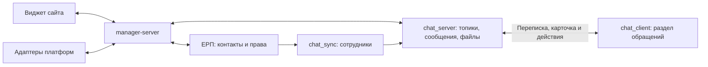

# manager: техническое задание на взаимодействие

Редакция 0.2 · 10.09.2026 · рабочее ТЗ после разрешения перейти к реализации.

Первый этап виджета выполнен локально. Реализованный клиентский контракт
описан в [RUNTIME_CONTRACT](../../manager-client/docs/RUNTIME_CONTRACT.md).
Этот документ определяет предстоящую производственную реализацию сервиса;
демосервер виджета её не заменяет.
Подтверждённые пользовательские правила перечислены в
[DECISIONS.md](DECISIONS.md). Ниже названия новых полей, маршрутов и событий
являются проектируемыми контрактами, а не утверждением, что такие API уже есть.
Найденные существующие точки входа отдельно перечислены в
[REUSE_AUDIT.md](REUSE_AUDIT.md).

## 1. Пользовательский результат

Посетитель пишет на сайте, оставляет контакты и прикладывает файлы. Менеджеры
с доступом через роль ЕРП получают обращение в новом разделе СЭП Чата.
Любой из них может отвечать. Первый ответ автоматически назначает
ответственного, если ранее его не назначили вручную; последующие ответы
не меняют ответственного. Ручное переназначение остаётся доступным.

Менеджер видит источник, текущий диалог, сведения о клиенте, найденный контакт
ЕРП и прежние обращения этого клиента из разных каналов. Посетителю доступен
только текущий диалог. Действие «Добавить в СЭП» синхронизирует контакт с ЕРП
и не создаёт клиенту учётную запись сотрудника.

## 2. Границы сервисов и владельцы данных

| Данные/функция | Владелец | Правило |
| --- | --- | --- |
| Виджет, состояния формы, черновик | manager-client | Не содержит служебных ключей или токена сотрудника |
| Установка сайта и подключение канала | manager-server | Домен, конфигурация и направление ответа определяются сервером |
| Внешний клиент и его идентификаторы | manager-server | Постоянный внутренний ID; телефон и email — атрибуты сопоставления |
| Обращение, связь с топиком, ответственный | manager-server | Единые бизнес-правила для всех каналов |
| Сохранённые сообщения и медиа | chat_server | Штатные операции создания и обработки файлов |
| Надёжная доставка между сервисами | Каждый отправитель своей операции | Сохраняет задачу доставки и результат; повтор не создаёт дубль |
| Контакт, реквизиты и история действий ЕРП | ЕРП | Создание через ContactService, с реальным сотрудником-инициатором |
| Права роли | ЕРП | Сервер чата и manager-server проверяют актуальные полномочия |
| Представление для менеджера | chat_client | Переиспользует существующие список сообщений, редактор и файлы |

Предлагаемый стек manager-server: NestJS/TypeScript, PostgreSQL, Bun;
RabbitMQ для событий чата и фоновой доставки. Это согласуется с chat_server.
Повторное использование существующего транспорта не требует bot-api.
Окончательное разделение worker-процесса и HTTP-процесса определяется при
подготовке развёртывания, отдельный репозиторий для worker не нужен.

manager-server хранит в своей базе обращения, связи, состояние доставки и
входящие данные, необходимые для надёжного приёма. После сохранения сообщения
в чате его каноническая версия находится в chat_server. Кеш/проекция сервиса
восстанавливаются по сообщениям и событиям чата. Прямой записи в чужие базы нет.

## 3. Модель обращения и топика

Один внешний диалог → одно обращение → один топик. Один клиент → несколько
обращений и идентификаторов каналов. Закрытие окна виджета само по себе
не создаёт новую запись и не закрывает обращение.

Предлагаемые сущности в manager-server:

- `Site`: публичный siteId, разрешённые origins, название/аватар компании,
  приветствия, ссылки, расписание и лимиты.
- `ChannelConnection`: тип платформы, идентификатор подключения, серверные
  настройки доставки; для виджета это подключение сайта.
- `Customer`: внутренний ID, имя, реквизиты, возможный erpContactId и состояние
  сопоставления. Без обязательного требования иметь контакт в ЕРП до обращения.
- `CustomerIdentity`: customerId, connectionId, идентификатор пользователя
  платформы, нормализованные контакты, происхождение и степень подтверждения.
- `Inquiry`: customerId, connectionId, внешний conversationId, chatTopicId,
  источник и страница, ответственный, состояние, время создания.
- `GuestSession`: ограничение текущим обращением и сайтом, срок действия,
  право чтения/отправки в текущем диалоге; без общего customer-history scope.
- `DeliveryOperation`: уникальный ключ, направление, исходное сообщение,
  chatMessageId/внешний ID, статус и последняя ошибка.
- `ErpSyncOperation`: ключ операции, клиент, инициатор, итоговый контакт и статус.
- `AssignmentEvent`: прежний/новый ответственный, инициатор, причина и порядок.

Источник сайта определяется по зарегистрированному Site/ChannelConnection,
а не по произвольной строке из браузера. URL страницы и разрешённые рекламные
метки сохраняются отдельно от доверенного источника; служебные и секретные
параметры URL не копируются в карточку обращения.

Топики сейчас имеют типы `GROUP` и `DM`. Предлагается сохранять транспортный
тип `GROUP` и добавить типизированное назначение `EXTERNAL_INQUIRY` со связью
на обращение. Назначение возвращается в общих схемах топиков и применяется
сервером при фильтрации списков, выдаче доступа и обработке событий.
Не кодировать принадлежность разделу в названии или description группы.
Это должно быть отдельным архитектурным решением перед миграцией.

У сообщения в текущей модели обязателен senderUserId с внешним ключом users.
Для посетителя предлагается ограниченный внешний профиль автора в чате:
имя и аватар для стандартного отображения, типизированная связь с внешним
клиентом, запрет обычной авторизации и включения в справочник сотрудников.
Подключение платформы не выдаёт такому профилю токен чата. Менеджерские
сообщения всегда сохраняют настоящий senderUserId сотрудника.
Сервисная авторизация для приёма сообщения отделена от отображаемого автора.

Минимальные состояния обращения: `OPEN` и `CLOSED` предлагаются для обсуждения.
Правило повторного открытия и новый диалог после закрытия ещё не утверждены;
оно не должно автоматически объединять разные обращения одного клиента.

## 4. Входящее обращение

1. Загрузчик виджета остаётся скрытым. Сервис проверяет сайт, открывает гостевую
   сессию и возвращает только публичную конфигурацию и признак готовности.
2. Виджет получает первое сообщение, затем показывает форму контактов.
   Момент доставки менеджерам зависит от решения D-03. Базовое предложение:
   сохранить черновик на странице и передать всё после формы.
3. Подтверждённая пользователем отправка получает один clientOperationId.
   Сервис проверяет сессию, размер, текст, контакты и принадлежность загрузок.
4. В одной транзакции своей базы сохраняет обращение/операцию приёма и
   задание доставки. Повтор возвращает тот же результат. При несовпадающем
   содержимом с тем же ключом возвращает конфликт.
5. Через внутреннюю команду chat_server обеспечивает единственный топик,
   участников и внешний профиль автора. Проверки и записи в базу чата
   выполняются самим chat_server с его штатными сервисами.
6. Сообщение и медиа проходят штатное сохранение. Сервис сохраняет chatMessageId
   и обновляет статус доставки. Менеджеры получают стандартное событие чата.

«Принято сервисом», «доставлено в чат» и «показано получателю» — разные
состояния. HTTP-подтверждение приёма не означает, что менеджер прочитал текст.
Существующий статус сообщения чата `DELIVERED` также не доказывает доставку
во внешнюю платформу. В интерфейсе использовать понятные подписи статусов.

Готовность виджета зависит от способности сервиса надёжно принять и сохранить
обращение. Сбой ЕРП не блокирует переписку. Временный сбой chat_server допускает
приём только при работающем постоянном буфере доставки и в пределах заданного
лимита очереди; статус при этом «принято, ожидает доставки». При отсутствии
надёжного приёма или переполнении буфера сервис сообщает недоступность,
и виджет скрывается. Бюджет очереди и задержки закрепить до запуска.

## 5. Ответ из СЭП Чата

1. Менеджер открывает раздел и отвечает штатным редактором. Сервер проверяет
   право на раздел и конкретный топик на момент записи.
2. Сохранение ответа создаёт надёжно восстанавливаемое событие для manager-server.
   В нём есть стабильный eventId, версия, topicId, messageId, реальный автор,
   назначение топика и порядок записи в пределах диалога.
3. Сервис принимает событие один раз, определяет связанное обращение,
   назначает ответственного при необходимости и ставит отправку в канал.
4. Адаптер доставляет текст и разрешённые вложения в conversationId исходного
   подключения. Историю других обращений и служебную карточку он не пересылает.
5. Результат доставки обновляет её состояние и при необходимости показывается
   менеджеру с возможностью повтора без дублирования сообщения в чате.

Не пересылать в канал события настройки топика, назначения, синхронизации ЕРП,
приветствия виджета, внутренние карточки или сообщения самого внешнего автора.
Внешний пользователь не может подделать направление или kind события.
Ответы в топике обращений по умолчанию считаются ответами клиенту. Если позднее
нужны внутренние заметки, это отдельный явно обозначенный вид сообщения.

Редактирование и удаление штатных сообщений уже существуют в чате. Для
виджета предлагается синхронизировать изменение/удаление в текущем диалоге
с учётом прав автора. Для будущих платформ нужен список возможностей:
если платформа не поддерживает изменение, не показывать менеджеру ложный успех.
При первом включении раздела неподдержанные внешним каналом действия должны
быть скрыты или явно отклоняться до изменения сообщения.

## 6. Первый ответ и ручное назначение

Первый ответ определяем по каноническому порядку сохранения сообщений чата,
а не по порядку доставки событий из очереди. Обработка одного топика сохраняет
порядок. Перед применением более позднего события закрываются пропуски истории.

Автоматическое назначение выполняется одной условной записью, только если
ответственный пуст и ещё не было ручного назначения. Текстовый ответ и ответ
с одним вложением равнозначны. Повтор события, чтение, реакция или системное
сообщение не запускают назначение.

Ручное назначение сериализуется с автоматическим. Если оно произошло раньше
обработки первого ответа, автоматическое назначение его не перезаписывает.
Следующий ответ другого менеджера не меняет ответственного. Ручная очистка,
если её решат поддержать, не должна заново включать автоматическое назначение
без отдельно заданного правила.

Назначение не ограничивает ответ, чтение и работу других уполномоченных
менеджеров. Новый ответственный выбирается из сотрудников с актуальным доступом.
Исторический ответственный может отображаться после отзыва его прав,
но само назначение не возвращает ему доступ.

## 7. Клиент и ЕРП

Телефон нормализуется с учётом кода страны; сохраняется исходное значение.
Email очищается от внешних пробелов, домен приводится к каноническому виду;
правило сравнения регистра локальной части согласуется с данными ЕРП.
Нельзя удалять точки/суффиксы адреса по правилам отдельного почтового провайдера.

Стабильная подтверждённая связь channel identity → customer имеет приоритет.
Введённые контакты используются для поиска кандидатов, но не маркируются
подтверждённой личностью. Один общий телефон организации не гарантирует
одного человека. В карточке менеджера показывается основание совпадения.

| Результат поиска | Действие |
| --- | --- |
| Есть действующая подтверждённая связь | Использовать существующего клиента и контакт |
| Одно совпадение по новым введённым данным | Предложить связь менеджеру; автоматизацию разрешать только по утверждённому правилу D-04 |
| Телефон и почта совпали с разными контактами | Конфликт, выбор менеджером без автоматического объединения |
| Несколько совпадений | Показать кандидатов и их различия |
| Совпадений нет | Новый клиент сервиса; предложить «Добавить в СЭП» |
| ЕРП недоступна | Переписка работает; поиск/синхронизация имеют явное ожидающее или ошибочное состояние |

Для менеджера общая история формируется после установленной связи клиента.
При ручном выборе ошибочной связи должна оставаться возможность её исправить
с записью в журнал; физическое слияние историй не требуется для просмотра.

«Добавить в СЭП»:

1. Проверить полномочия сотрудника и сопоставить chat UUID с ERP user ID по
   доверенным серверным данным. Не брать ERP ID из произвольного тела запроса.
2. Повторно найти контакт и предложить связывание, если уже существует кандидат.
3. Для создания преобразовать имя в `initial`, телефон/email — в `requisites`
   с `title.type` из штатного EnumRequisitesType. Схема реквизитов не является
   упрощённой парой `{title: 'phone', value}` из примера модели.
4. Выполнить штатный ContactService.createContact с реальным инициатором,
   историей ActionsService и транзакцией ЕРП. Не создавать сотрудника Users.
5. Вернуть и сохранить erpContactId, затем прочитать результат и показать связь.

Существующий POST contacts не имеет доказанного механизма повторного создания
по внешнему ключу. Поэтому операция синхронизации требует ключа, сохраняемого
в той же транзакции ЕРП, что и контакт. Обёртка интеграции вызывает канонический
ContactService; таймаут после commit разрешается чтением результата по ключу.
Два менеджера и сетевой повтор не должны создавать два контакта.
Существующий контакт не перезаписывается полями из виджета без явного действия.

## 8. Роли и общий доступ

Предлагается новый ключ доступа к разделу в модели прав ЕРП. Пользователь с
этим доступом видит все обращения и может отвечать/переназначать согласно
требованию. Действия над контактами дополнительно сохраняют действующие
правила ЕРП. Конкретный ключ и его отображение нужно добавить в общую схему,
редактор ролей, серверную проверку полного набора прав и миграцию старых ролей.
Для старых ролей новое право по умолчанию выключено.

Передача одного названия роли из chat_sync недостаточна. Требуется проверенный
снимок полномочий сотрудника и события изменения доступа, включая изменение
прав самой роли без изменения пользователя. Строка «Менеджер» не используется
как проверка полномочий.

chat_server остаётся точкой фактической проверки доступа к топику. Участие
проецируется в TopicSetting/GroupMemberRole через штатные операции.
Дополнительно для внешних топиков проверяется право раздела, чтобы отставшая
проекция участников не давала доступ после отзыва роли.

При выдаче доступа обеспечивается доступ ко всем существующим обращениям.
При отзыве: удаление участия, отключение подписок, запрет истории/поиска,
медиа/превью и отправки, удаление раздела и очистка локального кеша этих топиков.
Уже скачанные человеком файлы удалённо отозвать невозможно; новый доступ
к серверу после отзыва должен быть запрещён.

Перед запуском утвердить верхнюю границу задержки отзыва. Предложение:
событие сразу плюс перепроверка актуальности не реже 60 секунд; просроченный
снимок не предоставляет доступ. Это обязательный интеграционный сценарий,
а не только проверка видимости пункта меню.

## 9. Файлы и вложения

Хранение, шифрование, обработка изображений/видео, генерация превью и
привязка Media к Message переиспользуются из chat_server. Второе независимое
файловое хранилище для manager-server не создаётся.

Нужен ограниченный сценарий гостевой загрузки поверх этой инфраструктуры:

1. Гость запрашивает загрузку в своей сессии. Сервис проверяет квоту, тип,
   заявленный размер и принадлежность текущему обращению/черновику.
2. chat_server выдаёт ограниченную загрузочную сессию для внешнего обращения;
   служебные ключи остаются между серверами. Файловое содержимое проходит
   существующие операции хранения, без доверия к имени objectPath от гостя.
3. Завершение проверяет фактический размер, тип, принадлежность и состояние
   обработки. Сообщение ссылается на attachmentId, а не на произвольный URL.
4. Чтение/превью проверяет текущую сессию и её обращение либо актуальные
   полномочия менеджера. Все варианты одного файла подчиняются тем же правилам.
5. Незавершённые и не привязанные загрузки очищаются по сроку жизни.

Существующий публичный маршрут чтения объектов нельзя использовать для обхода
нового ограничения: файлы внешних обращений должны быть защищены и от прямого
обращения по этому маршруту. Выделить их область/метаданные и проверять это
в общем файловом пути. Обычные файлы чата не менять без отдельной оценки
совместимости. Ограничения гостевых файлов утвердить отдельно; внутренние
600 MiB не переносить автоматически на публичный сайт.

## 10. Контракты и надёжность

Предлагаемая публичная поверхность manager-server:

| Операция | Проектируемый маршрут | Основной результат |
| --- | --- | --- |
| Инициализация виджета | POST /v1/widget/session | Публичная конфигурация, ограниченная сессия, готовность |
| Отправка первого обращения | POST /v1/widget/inquiries | Один результат на идентификатор операции; в контракте виджета поле operationId; поведение зависит от D-03 |
| Следующее сообщение | POST /v1/widget/inquiries/:id/messages | Приём с дедупликацией |
| Чтение текущего диалога | GET /v1/widget/inquiries/:id/messages?after=… | Ограниченная страница; других обращений нет |
| Обновления текущего диалога | /v1/widget/events | WebSocket с авторизацией и возобновлением по курсору |
| Загрузка/чтение файла | /v1/widget/attachments/… | Операции только текущей сессии |

Менеджерские карточки, поиск, назначение и синхронизация доступны через
сервер чата с его авторизацией и далее через доверенный контракт manager-server.
Публичная гостевая сессия не принимается ни одним менеджерским маршрутом.
Конкретные URL фиксируются в исполняемых общих схемах до начала интеграции.

Внутренние команды чата: ensureInquiryTopic, acceptExternalMessage,
reconcileInquiryMembers, операции ограниченных вложений, чтение событий
внешних топиков. Расширяют существующие сервисы, сохраняя их проверки,
а не выполняют прямые вставки из manager-server.

Для обмена используется версионированный конверт: eventId, type, version,
occurredAt, inquiryId/topicId, messageId, actor, direction, perTopicSequence.
Получатель записывает eventId вместе с выполненным действием. Источник
фиксирует отправку события в той же транзакции, что и изменение, либо
предоставляет доказуемо полный журнал для восстановления. Текущая публикация
RabbitMQ сама по себе такой гарантии не даёт.

Обработать известное расхождение `EDIT` в издателе чата и `CHANGE` в установленном
общем контракте; вложения также требуют явной схемы или ограниченного
дочитывания по messageId. Новые публичные схемы виджета и manager можно
разместить пакетом внутри manager-server, без третьего нового репозитория.
Схемы топиков/сообщений чата остаются в `@pksep/zod-shared-chat`.

Обязательные свойства: ограниченные повторные попытки, отдельное состояние
доставок после исчерпания попыток, повтор без дублей, восстановление после
перезапуска, проверка версии контрактов, ограниченная пагинация.
Уникальность обеспечивается базой, а не только проверкой «сначала найти».
Нельзя гарантировать ровно одну видимую доставку для будущей платформы,
пока не проверены её собственные механизмы повторов.

## 11. Раздел СЭП Чата

Добавить раздел «Обращения» в существующую навигацию. В списке показывать
клиента, источник/платформу, последнее сообщение, время, непрочитанное,
ответственного и результат связи с ЕРП. Все уполномоченные менеджеры видят
общий набор; персонального фильтра, скрывающего чужие обращения, по умолчанию нет.

При открытии — штатная переписка топика и карточка обращения: источник/страница,
контакты, найденная запись ЕРП, история других обращений клиента,
назначение ответственного и «Добавить в СЭП».
Другие обращения открываются отдельными топиками с сохранением источника ответа.

Назначение внешнего топика фильтруется на сервере и учитывается в клиентском
кеше, поиске, непрочитанных, уведомлениях и прямой навигации. Обычные чаты,
звонки, ИИ, профиль, избранное и комментарии сохраняют существующее поведение.

## 12. Конфигурация, запуск и проверка

Расписание, допустимые источники, лимиты и публичные тексты задаются серверной
конфигурацией. Экран администрирования настроек не входит автоматически
в первую версию; для старта достаточно документированного способа настройки.
Ключи платформ и внутренних сервисов хранятся в окружении сервера.

На этапе реализации нужны локальный стенд, миграции и откат, проверки
готовности и метрики: очередь приёма, задержка доставки, ошибки платформ,
повторы, конфликты контактов и отставание прав. Проверки с записями выполняются
на локальных тестовых данных. Текущий документ не подтверждает работоспособность
развёрнутых сервисов: проведён анализ исходников, runtime-тестов ещё нет.

Полная матрица приёмки и последовательность реализации — в [PLAN.md](PLAN.md).
